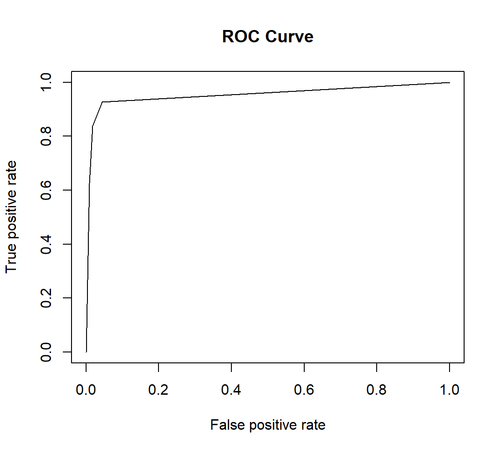

用你熟悉的脚本语言对BreastCancer数据集的预测结果`BreastCancer_predict.txt`进行评估，画出ROC curve，提交代码和ROC curve的图片。`BreastCancer_predict.txt`中第一列为真实的数据标签，包括良性(benign,0)和恶性(malignant,1)，第二列为预测为正类(malignant,1)的概率值，用制表符"\t"分隔。

用到的代码如下：
```
# 导入数据
BreastCancer_predict <- read.delim("~/BreastCancer_predict.txt")

# 创建空的350长度的Y和predicted_probs
Y <- matrix(c(rep(2, 350)), byrow = TRUE, nrow = 1)
predicted_probs <- numeric(length = 350)

# 处理BreastCancer_predict.txt的数据
for (i in 1:350)
{
  if (BreastCancer_predict[i, 1] == "benign")
  {
    Y[i] = 0
  }
  else
  {
    Y[i] = 1
  }
  
  predicted_probs[i] <- BreastCancer_predict[i, 2]
}

#将Y转置，以便绘图
Y_test <- t(Y)

# 预测
pred <- prediction(predicted_probs, Y_test)
auc <- performance(pred, 'auc')@y.values

#输出auc
auc

# 得到
[[1]]
[1] 0.9534938

# 画ROC曲线
roc <- performance(pred, "tpr", "fpr")
plot(roc, main = 'ROC Curve')
```


