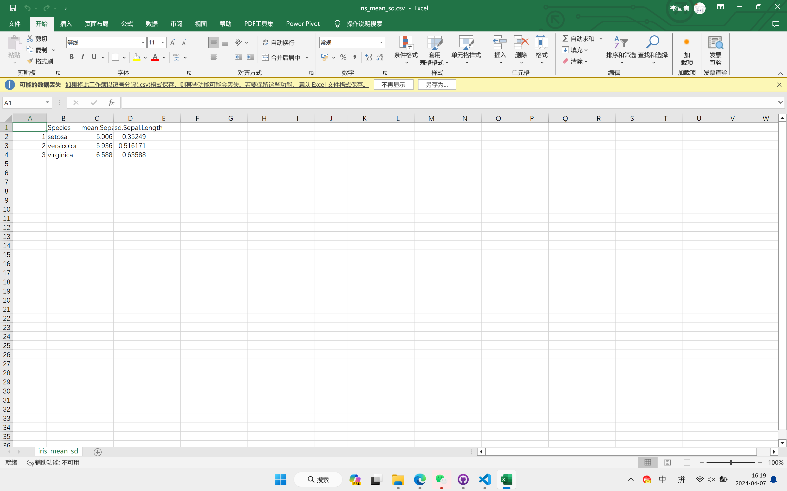

上机任务：

iris是R语言自带的一个数据集，它默认会作为一个数据框加载到R环境中，请对iris数据做如下分析：

1. iris数据集有几列？每列的数据类型是什么?

    有5列，前4列数据类型为numeric，第5列数据类型为factor。
    所用的代码如下：

```
# 直接查看数据集前几行，或者用colnames()输出各列名称均可得知有5行
> head(iris)
  Sepal.Length Sepal.Width Petal.Length Petal.Width Species
1          5.1         3.5          1.4         0.2  setosa
2          4.9         3.0          1.4         0.2  setosa
3          4.7         3.2          1.3         0.2  setosa
4          4.6         3.1          1.5         0.2  setosa
5          5.0         3.6          1.4         0.2  setosa
6          5.4         3.9          1.7         0.4  setosa
> colnames(iris)
[1] "Sepal.Length" "Sepal.Width"  "Petal.Length" "Petal.Width" 
[5] "Species"     

# 用class()函数输出各列数据类型
> class(iris[["Sepal.Length"]])
[1] "numeric"
> class(iris[["Sepal.Width"]])
[1] "numeric"
> class(iris[["Petal.Length"]])
[1] "numeric"
> class(iris[["Petal.Width"]])
[1] "numeric"
> class(iris[["Species"]])
[1] "factor"
```

2. 按Species列将数据分成3组，分别计算Sepal.Length的均值和标准差，保存为一个csv文件，提供代码和csv文件的内容。

    代码如下：
```
# 先分别计算均值和标准差
> iris_mean <- aggregate(Sepal.Length ~ Species, iris, mean)
> iris_sd <- aggregate(Sepal.Length ~ Species, iris, sd)

# 由于aggregate()函数在按Species分组时，各组的次序是按ASCII码排序的，因此可以将两组数据直接合并
> Species = iris_mean$Species
> mean.Sepal.Length = iris_mean$Sepal.Length
> sd.Sepal.Length = iris_sd$Sepal.Length
> iris_mean_sd = data.frame(Species, mean.Sepal.Length, sd.Sepal.Length)

#将合并后的数据保存到csv文件
> write.csv(iris_mean_sd, "iris_mean_sd.csv")
```

保存的csv文件为`iris_mean_sd.csv`，其中的内容为：

```
> iris_mean_sd
     Species mean.Sepal.Length sd.Sepal.Length
1     setosa             5.006       0.3524897
2 versicolor             5.936       0.5161711
3  virginica             6.588       0.6358796
```



3. 对不同Species的Sepal.Width进行One way ANOVA分析，提供代码和输出的结果。

    所用的代码和输出的结果如下：
```
> summary(aov(Sepal.Width ~ Species, data = iris))
             Df Sum Sq Mean Sq F value Pr(>F)    
Species       2  11.35   5.672   49.16 <2e-16 ***
Residuals   147  16.96   0.115                   
---
Signif. codes:  0 ‘***’ 0.001 ‘**’ 0.01 ‘*’ 0.05 ‘.’ 0.1 ‘ ’ 1
```

