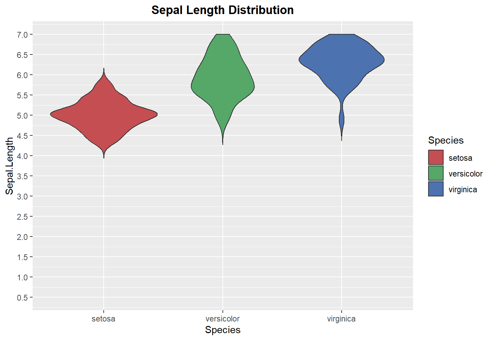

上机任务：

首先，请选择性练习下面各章的 plot 方法。

接着，基于ggplot2,用violin plot对iris数据集中不同Species的Sepal.Length长度分布进行可视化，并进行如下设置。画violin plot时可参考 2a)，对作图进行配置还可以参考本节的 1d) 和7)。 提交脚本和结果。

1.把图片标题设为"Sepal Length Distribution"，加粗居中(可使用labs函数和theme函数)

2.把y轴范围设为0.5到7之间(可使用scale_y_continuous函数)

3.三个Species的对应的填充颜色分别设为#C44E52, #55A868和#4C72B0(可使用scale_fill_manual函数)

使用的代码如下：

```
ggplot(iris, aes(x = Species, y = Sepal.Length)) +
  geom_violin(aes(fill = Species), trim = FALSE) + # 绘制violin图并按Species填充不同颜色
  scale_fill_manual(values = c("#C44E52", "#55A868", "#4C72B0")) + # 设置填充颜色
  labs(title = "Sepal Length Distribution") + # 设置标题
  theme(plot.title = element_text(face = "bold", hjust = 0.5)) + # 将标题加粗居中
  scale_y_continuous(limits = c(0.5, 7), breaks = seq(0.5, 7, by = 0.5)) #设置y轴范围为0.5到7
```

得到的小提琴图如下：

