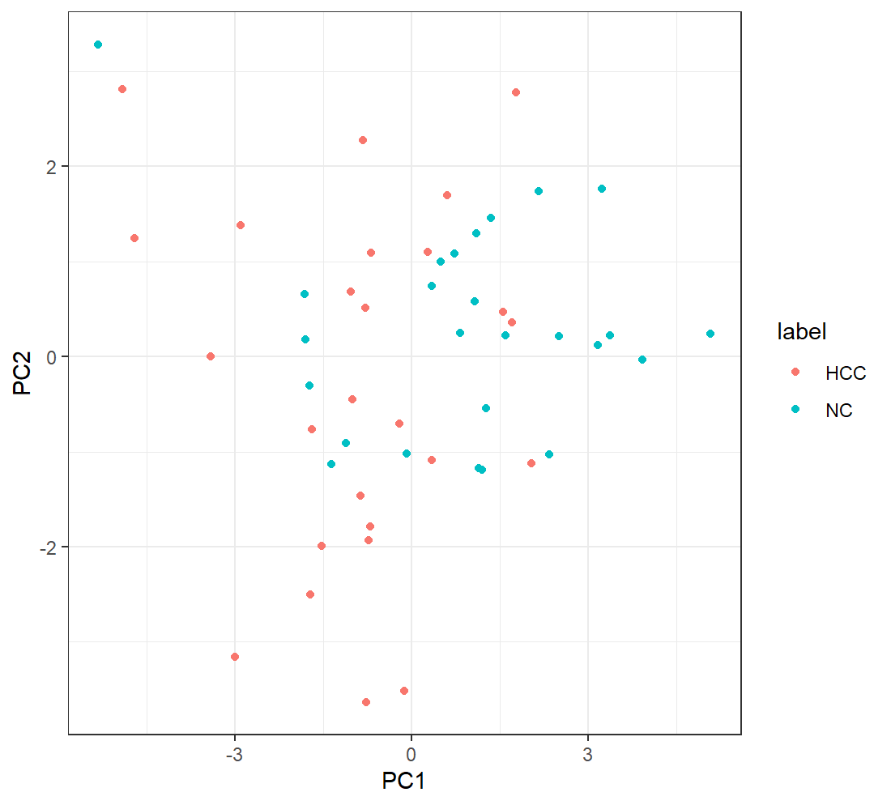
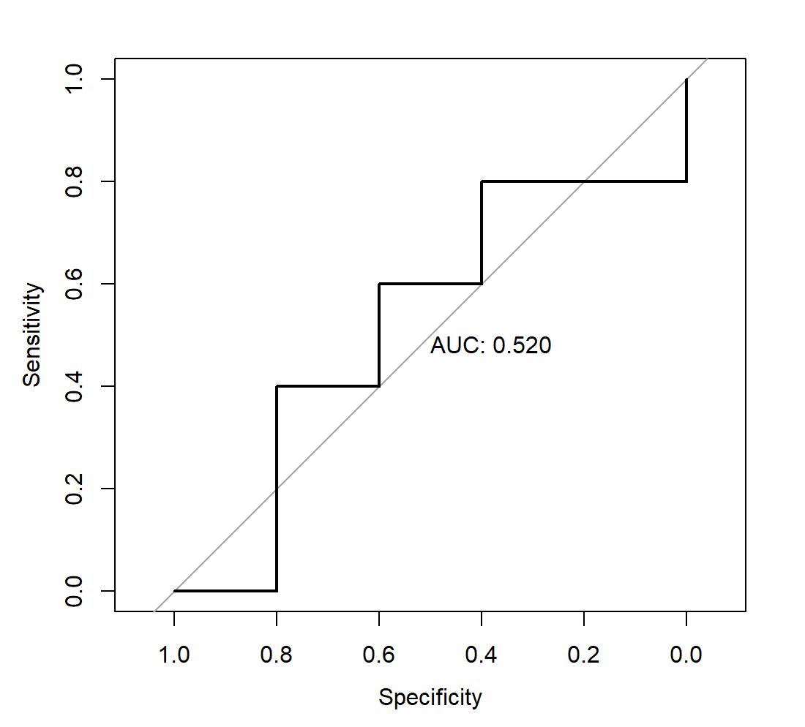

1. 我们提供了一个qPCR数据集`qPCR_data.csv`，第1列为sample id，第2-12列为特征(11个基因的表达量)，第13列为样本标签(负例为健康人：NC,正例为肝癌病人：HCC)。请大家用R语言完成以下任务：

    数据预处理

    用均值或中位数补全空缺值

    对数据进行scaling

    数据可视化

    用PCA对数据进行可视化

    数据集划分：预留20%数据用于评估模型泛化能力，剩下的用于模型拟合

    模型选择和模型拟合

    任选一种分类器即可

    特征选择: 用RFE或其他方式均可，特征数量不限

    调参: 根据所选的分类器对相应的超参数进行搜索

    模型评估

    计算预留数据集上的AUROC

    绘制ROC曲线

    请提交代码，必要的文字解释和ROC曲线

使用的代码如下：

```
# load R packages
library(glmnet)
library(caret)
library(pROC)
library(mlbench)

# 数据预处理
y <- qPCR_data$label
x <- qPCR_data[,2:12]
x <- apply(x,2,as.numeric)
# 用均值补全空缺值
feature.mean <- colMeans(x,na.rm = T)
x[is.na(x)] <- matrix(rep(feature.mean,each=length(y)), nrow=length(y))[is.na(x)]
# 对数据进行scaling
x <- scale(x,center = TRUE,scale = TRUE)

# 数据可视化
# load R packages
library("Rtsne")
library("ggplot2")
library("randomForest")
# 用PCA对数据进行可视化
X <- as.matrix(x[,1:11])
X <- scale(X, center = T, scale = T)
pca.res <- prcomp(X, center = F, scale = F, rank. = 2)
qPCR_data$PC1 <- pca.res$x[,1]
qPCR_data$PC2 <- pca.res$x[,2]
ggplot(qPCR_data, aes(x=PC1, y=PC2,color=label)) + geom_point() + theme_bw()

# 数据集划分：预留20%数据用于评估模型泛化能力，剩下的用于模型拟合
set.seed(666) # 固定random seed保证结果可重复
train.indices <- createDataPartition(y,p=0.8,times = 1,list=T)$Resample1
x.train <- x[train.indices,]
x.test <- x[ -train.indices,]
y.train <- as.factor(y[train.indices])
y.test <- as.factor(y[ -train.indices])

# 模型选择和模型拟合
# 基于randomForest的特征选择
rfFuncs$summary <- twoClassSummary
rfectrl <- rfeControl(functions=rfFuncs,
                      verbose = TRUE,
                      method="boot",number=10)
rfe.results <- rfe(x.train,y.train, 
               sizes=2:13, 
               rfeControl=rfectrl,
               metric = "ROC")
selected.features <- predictors(rfe.results)
selected.features
# 此处输出了7个特征
# [1] "miR.122"          "SNORD3B"          "miR.192"          "hsa_circ_0073052" "LINC01226"        "miR.21"          
# [7] "hsa_circ_0080695"

# 调参: 根据所选的分类器对相应的超参数进行搜索
params.grid <- expand.grid(alpha = c(0,0.5,1),lambda = c(0,0.01,0.1,1))
tr.ctrl <- trainControl(method="cv",
                        number = 5,
                        summaryFunction = twoClassSummary,
                        classProbs = TRUE)
cv.fitted <- train(x.train[,predictors(rfe.results)],y.train,
                   method="glmnet",
                   family="binomial",
                   metric = "ROC",
                   tuneGrid = params.grid,
                   preProcess = NULL,
                   trControl = tr.ctrl )
# 查看交叉验证得到的最好的一组超参数组合
cv.fitted$bestTune
# 此处输出了
#    alpha lambda
# 10     1   0.01

# 模型评估
# 获取测试集上的预测结果
y.test.pred.prob <- predict(cv.fitted,newdata=x.test,type="prob")
# 计算预留数据集上的AUROC，并绘制ROC曲线
roc.curve <- roc(y.test,y.test.pred.prob[,2])
plot(roc.curve,print.auc=T)
```

用PCA对数据进行可视化的结果如下：


绘制的ROC曲线图如下：



2. 请大家查阅资料，回答以下两个关于随机森林的问题：

    i) 随机森林中树的数量是不是一个需要通过交叉验证调整的超参数？为什么？

不是，因为森林里树的个数。理论上是越大越好，但是计算时间也相应增长。所以，并不是取得越大就会越好，预测效果最好的将会出现在合理的树个数。


    ii)请问什么是随机森林的out-of-bag (OOB) error?它和bootstrapping有什么关系？

bootstrapping sampling是自主采样法，指的是有放回的采样。这种采样方式，会导致约有36%的样本永远不会被采样到。具体计算过程：假设有m个样本，有放回的采样，每次被采样到的概率是(1/m)，每次不被采样到的概率是(1-1/m)；则(1-1/m)^n，当n足够大时，极限约为1/e（约等于36%）。

out-of-bag (OOB) error是“包外误差”的意思。在从x data中进行多次有放回的采样，能构造出多个训练集。由于bootstrap sampling的特点，在训练RF的过程中，一定会有约36%的样本永远不会被采样到。（对所有树来说36%的样本永远不会在任何一棵树的训练集中出现过。）用这个包外数据来做evaluation，就相当于用测试集来做evaluation，所以RF不需要再用测试集来做evaluation了。
