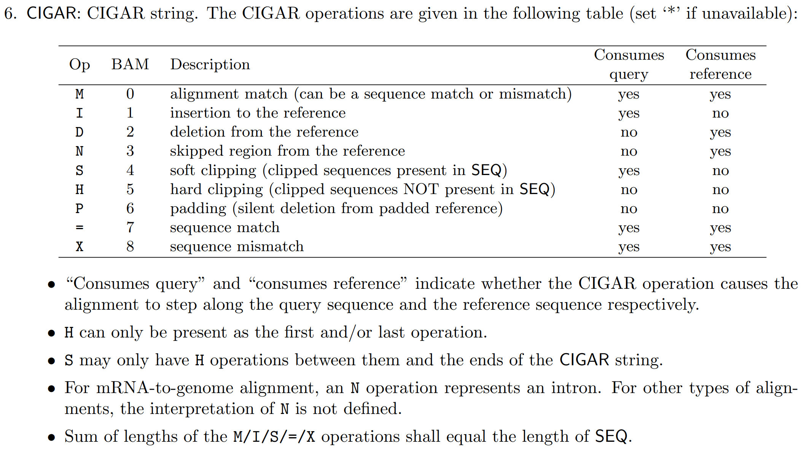
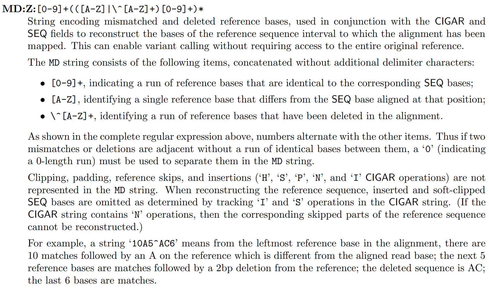

(1) 请阐述bowtie中利用了BWT的什么性质提高了运算速度？并通过哪些策略优化了对内存的需求？

利用了BWT的Last First Mapping性质（即最后一列L中出现某字符出现的顺序与第一列F某字符出现的次序是一致的）提高了运算速度。

通过BWT、Milestones、Checkpoints策略优化了内存需求。

(2) 用bowtie将`THA2.fa`mapping到`BowtieIndex/YeastGenome`上，得到`THA2.sam`，统计mapping到不同染色体上的reads数量(即统计每条染色体都map上了多少条reads)。

首先完成mapping，
```
test@bioinfo_docker:~/mapping$ bowtie -v 2 -m 10 --best --strata BowtieIndex/YeastGenome -f THA2.fa -S THA2.sam
# reads processed: 1250
# reads with at least one reported alignment: 1158 (92.64%)
# reads that failed to align: 77 (6.16%)
# reads with alignments suppressed due to -m: 15 (1.20%)
Reported 1158 alignments to 1 output stream(s)
```
然后统计THA2.sam文件中每条染色体都map上了多少条reads：
```
test@bioinfo_docker:~/mapping$ grep -v '^@' THA2.sam | awk '{print $3}' | sort | uniq -c | sort -n
     12 chrmt
     15 chrIII
     17 chrVI
     18 chrI
     25 chrIX
     33 chrV
     51 chrII
     56 chrXI
     58 chrXIV
     67 chrXIII
     68 chrVIII
     71 chrX
     78 chrXVI
     92 *
    101 chrXV
    125 chrVII
    169 chrXII
    194 chrIV
```

(3.1) 什么是sam/bam文件中的"CIGAR string"？ 它包含了什么信息？

CIGAR是对reads mapping情况的描述，一般由数字+字母组成，如24M表示有24 bp长的序列匹配，7I则表示有7 bp长的插入(insertion)，10D表示10 bp的缺失(deletion)。各字母的含义如下图：


(3.2) "soft clip"的含义是什么，在CIGAR string中如何表示？

soft clip是指在一条部分成功map的read两端比对不上的部分，如44S105M表示该条read后105 bp成功map到reference上，但是前45 bp不能match。其表示方法即为soft clip的序列长度+字母S，一般来说soft clip不能单独存在（因为整条不能匹配的read会以“*”表示）。

(3.3) 什么是reads的mapping quality？ 它反映了什么样的信息？

Mapping Quality的计算公式如下图：

其直接反映的是mapping出错的可能性，而从根本上则反映了测序的质量。

(3.4) 仅根据sam/bam文件的信息，能否推断出read mapping到的区域对应的参考基因组序列？

可以，根据CIGAR和SEQ两列的内容可以推出mapping到的refcerence的序列。其中，M对应的SEQ的序列即为reference序列；I表示insertion，其序列与reference无关；D表示deletion,deletion的序列同样会在SEQ中列出，列出的序列即为reference序列；N表示的skipped region序列也会在SEQ中列出对应的reference序列；S和H是没有mapping到的部分，无需考虑；P只是同一位置有多条reads匹配时的一种数据处理方式，与参考基因序列本身无关；


（4） 软件安装和资源文件的下载也是生物信息学实践中的重要步骤。请自行安装教程中未涉及的bwa软件，从UCSC Genome Browser下载Yeast (S. cerevisiae, sacCer3)基因组序列。使用bwa对Yeast基因组`sacCer3.fa`建立索引，并利用bwa将`THA2.fa` mapping到Yeast参考基因组上，并进一步转化输出得到`THA2-bwa.sam`文件。

用到的命令：
```
# 下载
wget https://github.com/lh3/bwa/archive/refs/heads/master.zip
unzip master.zip

# 安装
cd bwa-master/
make

# 下载参考基因组序列
mkdir REF
cd REF
wget https://hgdownload.soe.ucsc.edu/goldenPath/sacCer3/bigZips/sacCer3.fa.gz
gunzip sacCer3.fa.gz
cd ..

# 建立索引
./bwa index ./REF/sacCer3.fa

# 使用bwa将THA2.fa mapping到Yeast参考基因组上，并输出得到THA2-bwa.sam文件
./bwa-master/bwa mem ./bwa-master/REF/sacCer3.fa ./THA2.fa > THA2-bwa.sam
```

结果文件为THA2-bwa.sam
