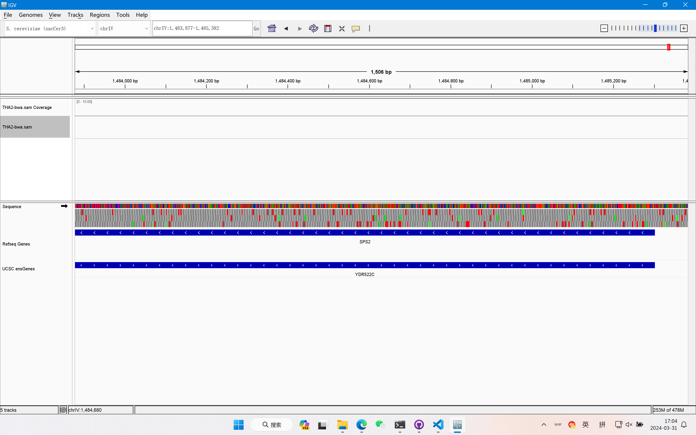

利用Genome Browser浏览 1.Mapping的 Homework 得到的sam/bam文件，并仿照上文中的 examples截图展示一个 gene的区域。

由于Mapping作业中用到的都是.fa文件，没有测序质量信息，且能匹配上sacCer3参考基因组的reads很少，由此处理得到的sam/bam文件质量很差，没有测序深度，在IGV中的显示效果不佳。

由于酵母没有内含子，因此其基因的显示方式与人类的不同，没有外显子和内含子的区分，但有基因转录方向。