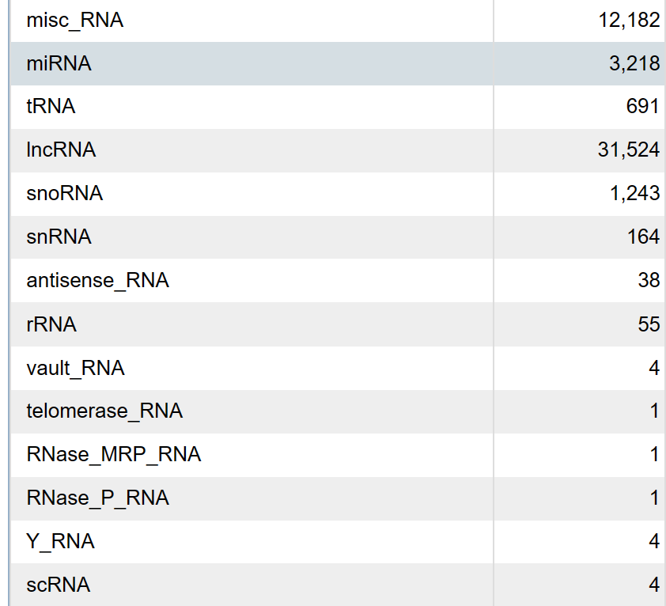

请大家查阅网络资源（如NCBI和ENSEMBL）以及文献等资料回答以下问题:

1) 人类基因组的大小以及基本组成是哪些？

    人类基因组大小为3,099,750,718个碱基对，
    
    GRCh38.p14 (Genome Reference Consortium Human Build 38), INSDC Assembly GCA_000001405.29, Dec 2013这一Assembly的数据量为contig length total 3.4 Gb & chromosome length total 3.1 Gb (excluding haplotypes).

    其基本组成包括：rRNA, mRNA, tRNA, snRNA, snoRNA, misc-srpRNA, misc-Y RNA, misc-other RNA, pesudogene, lncRNA, TUCP, miRNA, piRNA, circRNA, promoter, enhancer, intron, exon, transposable elements.

2) 基因中的非编码RNA的最新注释是多少个了？请详细列一下其中的非编码RNA的细分类型的数目，并对主要的非编码RNA是什么做的用1-2句解释一下。

    基因中的非编码RNA的最新注释是49,182个。其中，misc_RNA 12,182个、miRNA 3,218	个、tRNA 691个、lncRNA 31,524个、snoRNA 1,243个、snRNA 164个、antisense_RNA 38个、guide_RNA 29个、rRNA 55	个、vault_RNA 4个、telomerase_RNA 1个、RNase_MRP_RNA 1个、RNase_P_RNA 1个、Y_RNA 4个、scRNA 4个。

    

    (Reference: https://www.ncbi.nlm.nih.gov/genome/annotation_euk/Homo_sapiens/GCF_000001405.40-RS_2023_10/)