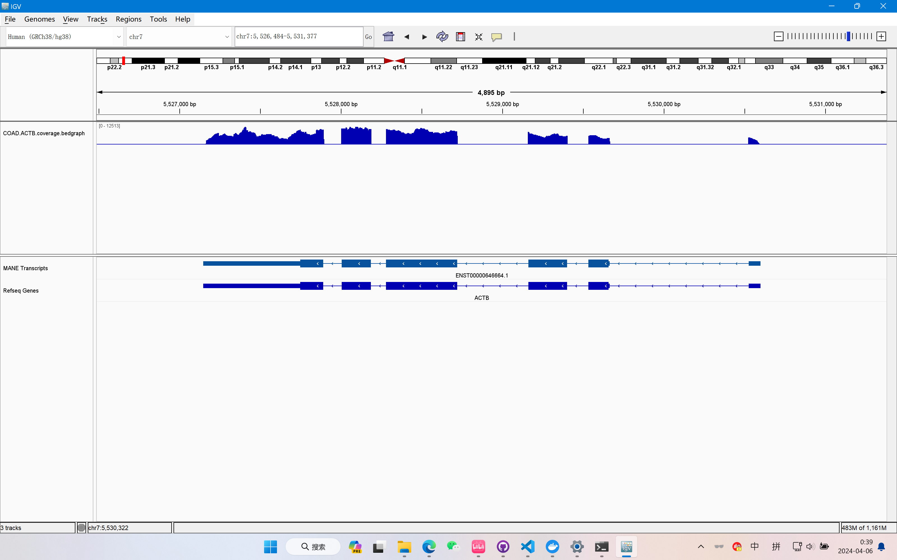

（1）我们提供的bam文件`COAD.ACTB.bam`是单端测序分析的结果还是双端测序分析的结果？为什么？

是单端测序的结果，因为对`COAD.ACTB.bam`文件使用samtools flagstat命令显示没有区分read1和read2，即没有正向和反向之分。
```
test@bioinfo_docker:~/samtools-bedtools/homework$ samtools flagstat COAD.ACTB.bam
185650 + 0 in total (QC-passed reads + QC-failed reads)
4923 + 0 secondary
0 + 0 supplementary
0 + 0 duplicates
185650 + 0 mapped (100.00% : N/A)
0 + 0 paired in sequencing
0 + 0 read1     # 此处没有read1和read2之分，即没有区分正反向
0 + 0 read2
0 + 0 properly paired (N/A : N/A)
0 + 0 with itself and mate mapped
0 + 0 singletons (N/A : N/A)
0 + 0 with mate mapped to a different chr
0 + 0 with mate mapped to a different chr (mapQ>=5)
```

（2）查阅资料回答什么叫做"secondary alignment"？并统计提供的bam文件中，有多少条记录属于"secondary alignment"？ 

secondary alignment是指这条read在基因组上有多个匹配区域（>=2），可以是read的同一部分有不同匹配区域，也可以是一条read上的不同区域分别各自由匹配区域。

有4923条记录属于"secondary alignment"，所使用的命令如下：
```
samtools view -bf 256  COAD.ACTB.bam >  COAD.ACTB.f.256.bam
samtools flagstat COAD.ACTB.f.256.bam
```
得到的结果为：
```
4923 + 0 in total (QC-passed reads + QC-failed reads)
4923 + 0 secondary     #改行表示筛选后的COAD.ACTB.f.256.bam文件中有4923条"secondary alignment"
0 + 0 supplementary
0 + 0 duplicates
4923 + 0 mapped (100.00% : N/A)
0 + 0 paired in sequencing
0 + 0 read1
0 + 0 read2
0 + 0 properly paired (N/A : N/A)
0 + 0 with itself and mate mapped
0 + 0 singletons (N/A : N/A)
0 + 0 with mate mapped to a different chr
0 + 0 with mate mapped to a different chr (mapQ>=5)
test@bioinfo_docker:~/samtools-bedtools/homework$
```

（3）请根据`hg38.ACTB.gff`计算出在ACTB基因的每一条转录本中都被注释成intron的区域，以bed格式输出。并提取`COAD.ACTB.bam`中比对到ACTB基因intron区域的bam信息，后将bam转换为fastq文件。

计算出在ACTB基因的每一条转录本中都被注释成intron的区域，以bed格式输出:
```
#!/bin/bash
grep -v '^#' hg38.ACTB.gff | awk 'BEGIN {OFS="\t"} $3 == "gene" {print $1, $4 - 1, $5 - 1, $2, $6, $7}' >> hg38.ACTB.gene.bed
grep -v '^#' hg38.ACTB.gff | awk 'BEGIN {OFS="\t"} $3 == "CDS" {print $1, $4 - 1, $5 - 1, $2, $6, $7}' >> hg39.ACTB.CDS.bed
bedtools subtract -a hg38.ACTB.gene.bed -b hg38.ACTB.CDS.bed >> hg38.ACTB.intron.bed
```
输出结果在`hg38.ACTB.intron.bed`文件中。

提取`COAD.ACTB.bam`中比对到ACTB基因intron区域的bam信息，后将bam转换为fastq文件：
```
# 暂存比对到ACTB基因intron区域的bam信息的seqname作为key
bedtools intersect -a hg38.ACTB.intron.bed -b COAD.ACTB.bam -wb | cut -f 10 > COAD.ACTB.intron.seqname
# 将bam格式转换为sam格式方便后续操作
samtools view -h COAD.ACTB.bam > COAD.ACTB.sam
# 将head复制到ACTB基因intron区域的bam文件中
grep '^@' COAD.ACTB.sam >> COAD.ACTB.intron.sam
# 用seqname作为key找到对应各行bam信息
for line in `cat COAD.ACTB.intron.seqname`
do
        grep $line COAD.ACTB.sam >> COAD.ACTB.intron.sam
done
# 将sam格式转换为bam格式方便后续操作
samtools view -b -S COAD.ACTB.intron.sam > COAD.ACTB.intron.bam
# 对bam文件排序，防止后续转换为fastq格式时出错
samtools collate COAD.ACTB.intron.bam COAD.ACTB.intron.collated
# 将比对到ACTB基因intron区域的bam文件转换为fastq文件
samtools fastq COAD.ACTB.intron.collated.bam > COAD.ACTB.intron.fq
```
得到结果文件`COAD.ACTB.intron.fq`。


(4) 利用`COAD.ACTB.bam`计算出reads在ACTB基因对应的genomic interval上的coverage，以bedgraph格式输出。（提示：对于真核生物转录组测序向基因组mapping得到的bam文件，bedtools genomecov有必要加-split参数。）

使用的命令如下：
```
samtools sort COAD.ACTB.bam > COAD.ACTB.sorted.bam
samtools index COAD.ACTB.sorted.bam
bedtools genomecov -split -ibam COAD.ACTB.sorted.bam -bg > COAD.ACTB.coverage.bedgraph
```
得到的结果在`COAD.ACTB.coverage.bedgraph`文件中，用IGV打开效果如下图。

