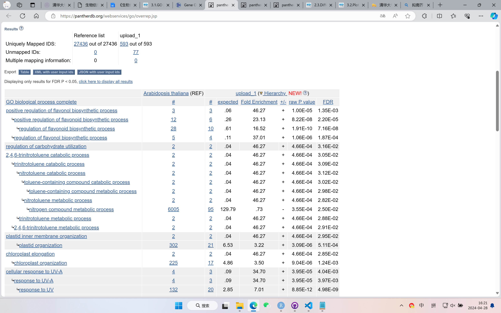
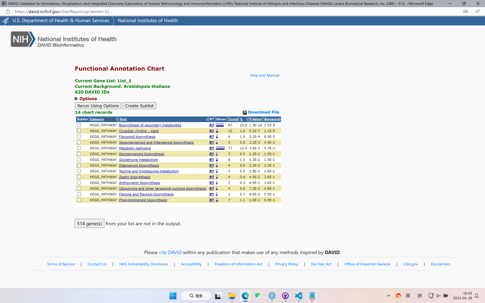

1. 从`wt.light.vs.dark.all.txt`(这是我们在差异表达一节获得的野生型的结果)中选取显著上调的(FDR<0.05, logFC>1)的基因进行GO分析。

GO分析所用的基因在文件`GO_analysis.txt`中，GO分析的Reference List选择Arabidopsis thaliana (all genes in database)。

结果文件为`GO_analysis.txt`：

2. 请问上面的例子中， Fold Enrichment和P value是如何计算的？ 请写出公式，并解释原理。此外，在定义显著富集的GO terms时为什么一般不是参考P value的大小，而是要计算一个FDR来做为参考？

Fold Enrichment = GeneRatio / BgRatio

其中，GeneRatio是富集到这个GO条目上的gene的数目/所有输入的做富集分析的gene的数目，通过是差异表达分析得到的gene；BgRatio (Background Ratio)是人的所有编码蛋白的基因中注释到这个GO条目上面的gene的数目/人的所有编码蛋白的基因中有GO注释的gene的数目。

随着检验次数的增加，发生Type I Error (即出现假阳性错误)的概率逐渐增大，p-value不再那么准确。因此，采用Benjamini and Hochberg FDR (BH)方法进行校正，以减少假阳性率，使GO分析更加准确。

3. 请用 KEGG enrichment 分析上一章(GO enrichment analysis)中的基因集，比较两章的结果，总结两种方法得到的生物学意义有哪些异同。

结果文件为`KEGG_analysis.txt`：

从结果文件的大小上来看，GO分析的结果数量多于KEGG的结果数量。在一定程度上，这体现出了GO侧重于单个基因功能而KEGG侧重于基因之间的相互作用的区别。

同时，也可以发现，KEGG的结果基本被GO的结果包括，说明两者均能反映基因之间的相互作用。

GO得到的结果更多，但过多的结果不一定是好事；KEGG的结果相对较少，但是更关注于基因间的相互作用，有时反而更能指明方向。
