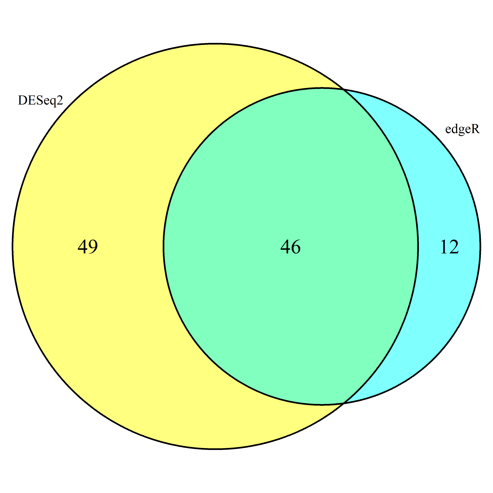
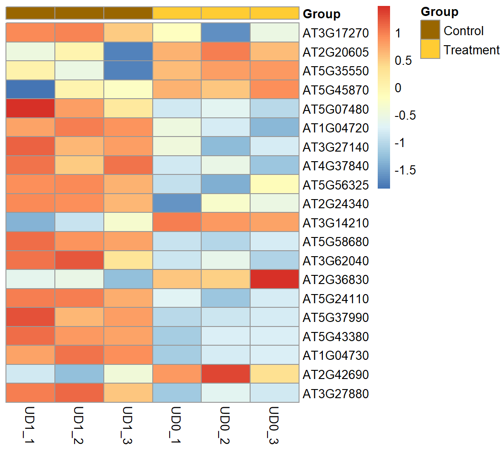
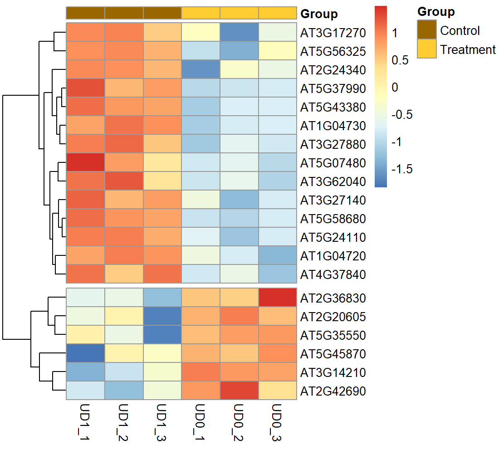

1. 什么是Multiple test correction？并解释q value(很多时候也叫FDR)和 p value的差别。

随着检验次数的增加，发生Type I Error (即出现假阳性错误)的概率逐渐增大，p-value不再那么准确。因此，采用Benjamini and Hochberg FDR (BH)方法进行计算得到FDR，或者采用Storey和Tibshirani的方法计算得到q value，两者均表示假阳性率，通过筛选控制假阳性率可以使GO分析更加准确。

2. 请结合上课时所讲的知识阐述DESeq2和edgeR中如何对数据进行 normalization，列出并解释具体的公式 。

对于差异表达的分析(Differential Expression Analysis)，edgeR使用TMM (Trimmed Mean of M-values)，即选取一个representative gene set (G)（通常选取一些表达水平变化很小的housekeeping gene），并给其中的每个gene一个权重(a weighted M)，对于任意一个样本(sample *j*)，根据其中属于gene set G的基因表达水平计算出TMM，从而实现归一化（**实际上是将representative gene set G作为“一”，这种做法有利于找到每一处变化，即使变化很小，但相对依赖于预设的gene set**）；DEseq2使用RLE (Relative Log Expression)，以各基因的raw counts/reads这一比值除以样本中所有基因raw counts/reads的几何平均值后的中位数作为归一化的系数(**可以认为是将样本基因表达值的对数的中位数作为了“一”，这种做法能凸显处基因表达变化的倍数大的基因，有利于找到最大的差异**)

3. 利用我们以上介绍的方法和数据，分别使用DESeq2和edgeR找出uvr8突变型（uvr8）在光照前后的差异基因，保存为文本文件

所用到的代码如下：

```
# 读取数据
raw.counts <- read.table("count_exon.txt", sep='\t', header = T,row.names = 1)
# 只使用uvr8突变型的数据进行分析
uvr8.raw.counts <- raw.counts[,c("UD1_1", "UD1_2", "UD1_3", "UD0_1", "UD0_2", "UD0_3")]
# 过滤掉表达量低的基因
uvr8.filtered.counts <- uvr8.raw.counts[rowMeans(uvr8.raw.counts) > 5, ]
# "UD1_1", "UD1_2", "UD1_3"三个样本为Control
# "UD0_1", "UD0_2", "UD0_3"三个样本对Treatment
conditions <- factor(c(rep("Control", 3), rep("Treatment", 3)),levels = c("Control","Treatment"))
colData <- data.frame(row.names = colnames(uvr8.filtered.counts),conditions=conditions)
# import DESeq2 package
library(DESeq2)
# 将数据导入转换成DESeqDataSet格式
dds <- DESeqDataSetFromMatrix(uvr8.filtered.counts, colData, design = ~conditions)
# 进行差异分析
dds <- DESeq(dds)
# 获取结果
res <- results(dds)
# 不过滤地保存所有结果
write.table(res,"uvr8.light.vs.dark.all.txt", sep='\t', row.names = T, quote = F)
# 筛选有差异的基因 （过滤标准: padj < 0.05, log2FoldChange > 1）
diff.table <- subset(res, padj < 0.05 & abs(log2FoldChange) > 1)
# 保存过滤后结果
write.table(diff.table,"uvr8.light.vs.dark.txt", sep='\t', row.names = T, quote = F)

# 使用edgeR前不必再次准备输入数据，但相关命令在此处仍然列出
# 读取数据
raw.counts <- read.table("count_exon.txt", sep='\t', header = T,row.names = 1)
# 只使用uvr8突变型的数据进行分析
uvr8.raw.counts <- raw.counts[,c("UD1_1", "UD1_2", "UD1_3", "UD0_1", "UD0_2", "UD0_3")]
# 过滤掉表达量低的基因
uvr8.filtered.counts <- uvr8.raw.counts[rowMeans(uvr8.raw.counts) > 5, ]
# 样本条件信息与之前相同
# "UD1_1", "UD1_2", "UD1_3"三个样本为Control
# "UD0_1", "UD0_2", "UD0_3"三个样本对Treatment
conditions <- factor(c(rep("Control", 3), rep("Treatment", 3)),levels = c("Control","Treatment"))
# 获取design矩阵
design <- model.matrix(~conditions)
# import edgeR package
library(edgeR)
# 定义edgeR用于存储基因表达信息的DGEList对象
y <- DGEList(counts = uvr8.filtered.counts)
# TMM标准化 (TMM 实际上是edgeR的默认参数)
y <- calcNormFactors(y, method="TMM")
# 估计dispersion
y <- estimateDisp(y,design = design)
# 拟合广义线性模型
fit <- glmFit(y, design = design)
# 似然比检验
# coef = 2指的是对design矩阵的第二列（即是否照光）对应的系数进行检验
lrt <- glmLRT(fit,coef=2) 
# 这里tag就是基因的意思，topTags意思是返回变化最top的基因
# 默认返回10个基因，按p值排序
# 这里我们用n = nrow(y)要求它返回所有基因的结果
diff.table <- topTags(lrt, n = nrow(y))$table
# 不过滤地保存差异分析的全部结果
write.table(diff.table, file = 'edger.uvr8.light.vs.dark.txt', sep = "\t", quote = F, row.names = T, col.names = T)
# 筛选有明显差异的基因 （过滤标准: padj < 0.05, log2FoldChange > 1）
diff.table.filtered <- diff.table[abs(diff.table$logFC) > 1 & diff.table$FDR < 0.05,]
# 保存过滤后的结果
write.table(diff.table.filtered, file = 'edger.uvr8.light.vs.dark.filtered.txt', sep = "\t", quote = F, row.names = T, col.names = T)
```

最终得到4个`.txt`文本文件，其中

`uvr8.light.vs.dark.all.txt`和`edger.uvr8.light.vs.dark.txt`是未经过滤的全部结果，

`uvr8.light.vs.dark.txt`和`edger.uvr8.light.vs.dark.filtered.txt`是按照padj < 0.05, log2FoldChange > 1的标准过滤的全部结果。


4. 对于uvr8突变型的差异基因，定义|log2FC|>1，FDR<0.05的基因为差异表达基因。比较两个软件得到的差异基因有多少是重合的，有多少是不同的，用venn图的形式展示。

所用的代码如下：

```
# download & import VennDiagram package
BiocManager::install("VennDiagram")
library(VennDiagram)
# 导入过滤后的数据
uvr8.light.vs.dark <- read.delim("~/diff_exp/uvr8.light.vs.dark.txt")
edger.uvr8.light.vs.dark.filtered <- read.delim("~/diff_exp/edger.uvr8.light.vs.dark.filtered.txt")
# 获取有显著差异的基因名
uvr8.DESeq2.filtered <- rownames(uvr8.light.vs.dark)
uvr8.edgeR.filtered <- rownames(edger.uvr8.light.vs.dark.filtered)
# 绘制Venn图
venn.diagram(list(DESeq2= uvr8.DESeq2.filtered, edgeR = uvr8.edgeR.filtered), fill = c("yellow", "cyan"), cex = 1.5, filename = "Venn_uvr8_filtered.png")
```

得到Venn图`Venn_uvr8_filtered.png`：



5. 对于edgeR找出的FDR<0.05的基因，选出log2FoldChange最大的10个基因和最小的10个基因。计算原始表达量矩阵的log10CPM值并对每个基因进行Z-score处理，使用刚才筛选出来的20个基因绘制热图（heatmap）作为最后结果输出。

```
# 使用edgeR做数据处理部分的命令与之前相同
# 读取数据
raw.counts <- read.table("count_exon.txt", sep='\t', header = T,row.names = 1)
# 只使用uvr8突变型的数据进行分析
uvr8.raw.counts <- raw.counts[,c("UD1_1", "UD1_2", "UD1_3", "UD0_1", "UD0_2", "UD0_3")]
# 过滤掉表达量低的基因
uvr8.filtered.counts <- uvr8.raw.counts[rowMeans(uvr8.raw.counts) > 5, ]
# "UD1_1", "UD1_2", "UD1_3"三个样本为Control
# "UD0_1", "UD0_2", "UD0_3"三个样本对Treatment
conditions <- factor(c(rep("Control", 3), rep("Treatment", 3)),levels = c("Control","Treatment"))
# 获取design矩阵
design <- model.matrix(~conditions)
# import edgeR package
library(edgeR)
# 定义edgeR用于存储基因表达信息的DGEList对象
y <- DGEList(counts = uvr8.filtered.counts)
# TMM标准化 (TMM 实际上是edgeR的默认参数)
y <- calcNormFactors(y, method="TMM")
# 估计dispersion
y <- estimateDisp(y,design = design)
# 拟合广义线性模型
fit <- glmFit(y, design = design)
# 似然比检验
# coef = 2指的是对design矩阵的第二列（即是否照光）对应的系数进行检验
lrt <- glmLRT(fit,coef=2) 


# 此处开始与之前命令有所不同

# 要求它按照log2FoldChange值排序返回所有基因的结果
diff.table <- topTags(lrt, n = nrow(y), sort.by = "logFC")$table

# 按照FDR < 0.05的标准筛选基因
diff.table.filtered <- diff.table[diff.table$FDR < 0.05,]

# 取log2FoldChange值最大的10个和最小的10个基因
diff.table.filtered.head10 <- head(diff.table.filtered, 10)
diff.table.filtered.tail10 <- tail(diff.table.filtered, 10)

# 获取相应的基因名
logFC.head10 <- rownames(diff.table.filtered.head10)
logFC.tail10 <- rownames(diff.table.filtered.tail10)

# 从所有基因的counts中挑出这20个基因的counts
uvr8.filtered.counts.head10tail10 <- uvr8.filtered.counts[c(logFC.head10, logFC.tail10),]

# 将data.frame格式转换成matrix格式
counts.matrix=matrix(nrow = 20, ncol = 6)
for (i in seq(1, 6)){
    counts.matrix[(i * 20 - 19):(i * 20)]=uvr8.filtered.counts.head10tail10[[i]]
}
colnames(counts.matrix)=colnames(uvr8.filtered.counts.head10tail10)
rownames(counts.matrix)=rownames(uvr8.filtered.counts.head10tail10)
# 计算CPM
CPM.matrix <- t(1000000*t(counts.matrix)/colSums(counts.matrix))
log10.CPM.matrix <- log10(CPM.matrix+1)
# 计算z-scores
z.scores <- (log10.CPM.matrix - rowMeans(log10.CPM.matrix))/apply(log10.CPM.matrix,1,sd)
# 在可视化前，将>2的z-score clip到2，<-2的z-score类似的clip到-2，避免展示出个别outlier的数值，导致绝大部分样本看起来颜色差异不明显的情况
for (i in seq_along(z.scores)){
  if(z.scores[i]!="NaN"){
    if(z.scores[i]>2){
      z.scores[i]=2
    }
    if(z.scores[i]<(-2)){
      z.scores[i]=(-2)
    }
  }
  else{
    z.scores[i]=0
  }
}
# 加载pheatmap包
library(pheatmap)
# 列注释（共150列的matrix中，前、中、后50列分别对应COAD、ESCA、READ）
annotation_col = data.frame(Group = factor(rep(c("Control", "Treatment"), c(3, 3))))
# 列注释与matrix列的对应关系
rownames(annotation_col) = colnames(z.scores)
# heatmap中注释的颜色
ann_colors = list(Group = c(Control = "#996600", Treatment = "#FFCC33"))

# 绘制heatmap图（不聚类）
pheatmap(z.scores, # 数据来源 
         cluster_rows=FALSE,  cluster_cols=FALSE, # 是否按行/列聚类
         show_rownames=TRUE,show_colnames = TRUE, # 是否展示各行/列名称
         annotation_col = annotation_col, annotation_colors = ann_colors) # 注释样本所对应的组别（光照前后）

# 绘制heatmap图（按行聚类）
pheatmap(z.scores, # 数据来源 
         cluster_rows=TRUE,  cluster_cols=FALSE, # 是否按行/列聚类
         cutree_rows = 2, # 将行分成两部分，区分上调和下调基因
         show_rownames=TRUE,show_colnames = TRUE, # 是否展示各行/列名称
         annotation_col = annotation_col, annotation_colors = ann_colors) # 注释样本所对应的组别（光照前后）
```

绘制得到的heatmap（不聚类）如下：



按行聚类如下：



很明显地，按行聚类区分出了uvr8突变型在光照处理前后基因表达量的上调和下调。

