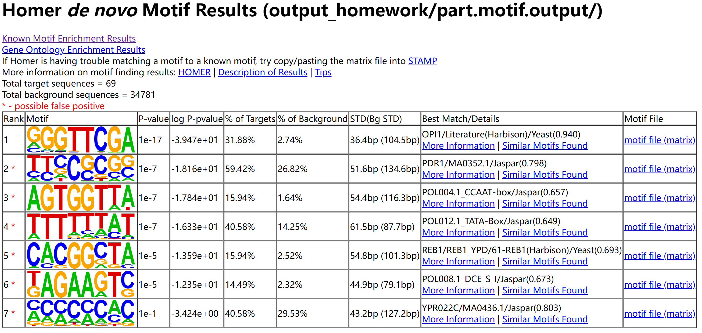
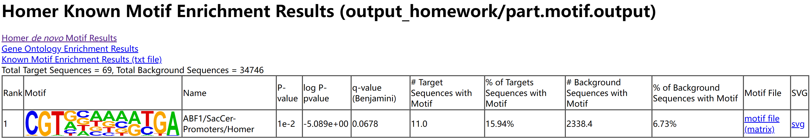

1. 请解释在ChIP-seq实验中为什么一般都要平行做一个control （通常叫input）的实验。

因为样本在获取、扩增等处理过程中（利用特定的抗体富集这一步以外的步骤中）或者样本本身，可能有一些序列的偏好或偏差。通过减去input，可以使得得到的测序结果均来自于抗体富集。

2. 请解释`findPeaks`和`findMotifsGenome.pl`主要参数的含义。

`findPeaks`的`-style`参数有factor和histone两种选项，这是因为转录因子的结合区域一般比较短，对应的peaks比较狭窄，被称为"narrow peaks"；存在组蛋白修饰的区域通常更长一些，对应的peaks也比较宽，被称为"broad peaks"。
`-o`是输出路径。
`-i`是存储input（即control）样本中间文件的"tag directory"。

`findMotifsGenome.pl`的`-len`参数是指motif长度，可以设置多个长度，用逗号隔开，默认为8,10,12。`-size`参数是指用于motif finding的区域长度（默认值为200），寻找转录因子motif时的建议值为50 bp，当还需要寻找"co-enriched" motifs时建议值为200 bp，当寻找histone marked regions时建议值为500-1000 bp。`-S`参数是指每个长度的motif需要找到的数量（默认值为25）。

3. 我们在容器的`/home/test/chip-seq/homework`目录中提供了酵母Snf1蛋白CHIP-seq的bam文件，`ip.chrom_part.bam`为IP实验数据，`input.chrom\_part.bam`为背景数据。请大家从这两个文件出发，用homer重复本章中介绍的peak calling和motif finding分析。请大家提交找到的motif的截图，以及`Fold Change (vs Control)`>=8且`p-value (vs Control)`<10^(−8)的peaks(建议放在同一个文件中提交)。

```
cd /home/test/chip-seq/

# 用makeTagDirectory产生peak calling所需的中间文件
makeTagDirectory homework/ip homework/ip.chrom_part.bam
makeTagDirectory homework/input homework/input.chrom_part.bam
# 从这两组中间文件出发进行peak calling
findPeaks homework/ip/ -style factor -o output_homework/part.peak -i homework/input/
# 做motif finding
findMotifsGenome.pl output_homework/part.peak sacCer2 output_homework/part.motif.output -len 8
# 筛选出Fold Change (vs Control)>=8且p-value (vs Control)<10^(−8)的peaks
grep -v '^#' output_homework/part.peak | awk '$11 >= 8 && $12 < 1e-8 {print $0}'
```

motif finding的结果如下：





`Fold Change (vs Control)`>=8且`p-value (vs Control)`<10^(−8)的peaks如下：

```
chrIV-1 chrIV   465220  465468  +       111129.9        0.920   15510.000000    15585.0 234.1   66.57   0.00e+00       55.11    0.00e+00        0.50
chrIV-2 chrIV   1490100 1490348 +       81687.8 0.857   11468.000000    11456.0 195.1   58.72   0.00e+00        35.06  0.00e+00 0.50
chrV-1  chrV    141138  141386  +       54449.0 0.855   7647.000000     7636.0  182.3   41.88   0.00e+00        21.55  0.00e+00 0.52
chrV-2  chrV    69078   69326   +       48659.0 0.823   6837.000000     6824.0  206.5   33.05   0.00e+00        20.52  0.00e+00 0.50
chrV-3  chrV    85195   85443   +       46277.4 0.861   6493.000000     6490.0  225.6   28.77   0.00e+00        21.56  0.00e+00 0.50
chrIV-3 chrIV   1080509 1080757 +       34405.0 0.832   4830.000000     4825.0  234.1   20.61   0.00e+00        23.11  0.00e+00 0.50
chrIV-4 chrIV   599953  600201  +       26597.0 0.755   3733.000000     3730.0  190.1   19.62   0.00e+00        15.58  0.00e+00 0.50
chrV-4  chrV    321939  322187  +       24821.5 0.754   3484.000000     3481.0  177.4   19.63   0.00e+00        13.66  0.00e+00 0.50
chrIV-5 chrIV   1468786 1469034 +       23595.0 0.794   3317.000000     3309.0  193.7   17.08   0.00e+00        14.36  0.00e+00 0.51
chrIV-6 chrIV   132817  133065  +       19402.3 0.782   2723.000000     2721.0  209.3   13.00   0.00e+00        11.95  0.00e+00 0.52
chrIV-7 chrIV   591669  591917  +       18304.2 0.792   2568.000000     2567.0  200.1   12.83   0.00e+00        12.88  0.00e+00 0.50
chrIV-8 chrIV   721812  722060  +       17840.7 0.739   2514.000000     2502.0  192.3   13.01   0.00e+00        9.61   0.00e+00 0.51
chrIV-9 chrIV   1       230     +       17206.1 0.884   2444.000000     2430.0  60.3    40.30   0.00e+00        632.81 0.00e+00 0.81
chrIV-10        chrIV   1233763 1234011 +       16250.6 0.888   2303.000000     2279.0  156.1   14.60   0.00e+00       10.68    0.00e+00        0.52
chrIV-11        chrIV   234340  234588  +       16179.3 0.790   2275.000000     2269.0  199.4   11.38   0.00e+00       9.37     0.00e+00        0.51
chrV-5  chrV    225453  225701  +       15066.9 0.901   2123.000000     2113.0  157.5   13.42   0.00e+00        11.73  0.00e+00 0.53
chrIV-12        chrIV   357166  357414  +       15052.6 0.705   2113.000000     2111.0  205.7   10.26   0.00e+00       8.19     0.00e+00        0.51
chrIV-13        chrIV   416932  417180  +       13954.5 0.838   1973.000000     1957.0  188.0   10.41   0.00e+00       10.83    0.00e+00        0.51
chrIV-15        chrIV   1278678 1278926 +       13697.8 0.852   1925.000000     1921.0  225.6   8.51    0.00e+00       12.86    0.00e+00        0.52
chrIV-16        chrIV   1164971 1165219 +       13419.7 0.746   1887.000000     1882.0  215.7   8.73    0.00e+00       9.29     0.00e+00        0.52
chrV-6  chrV    491091  491339  +       12457.1 0.773   1749.000000     1747.0  180.9   9.66    0.00e+00        13.69  0.00e+00 0.52
chrIV-14        chrIV   1525285 1525496 +       11779.7 0.923   1953.000000     1652.0  58.2    28.40   0.00e+00       32.51    0.00e+00        1.27
chrIV-17        chrIV   722439  722687  +       10774.3 0.676   1512.000000     1511.0  172.4   8.76    0.00e+00       5.26     0.00e+00        0.53
chrIV-46        chrIV   568825  569073  +       5005.7  0.820   705.000000      702.0   85.8    8.18    0.00e+00       4.54     3.86e-226       0.84
```